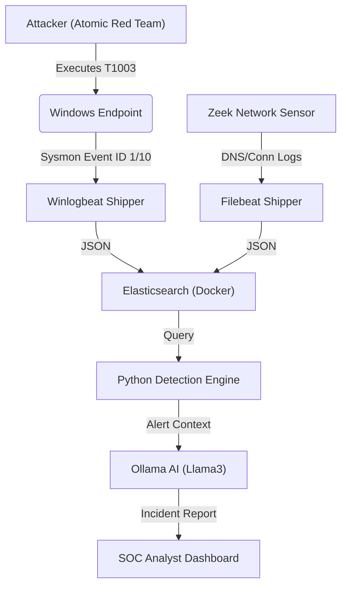
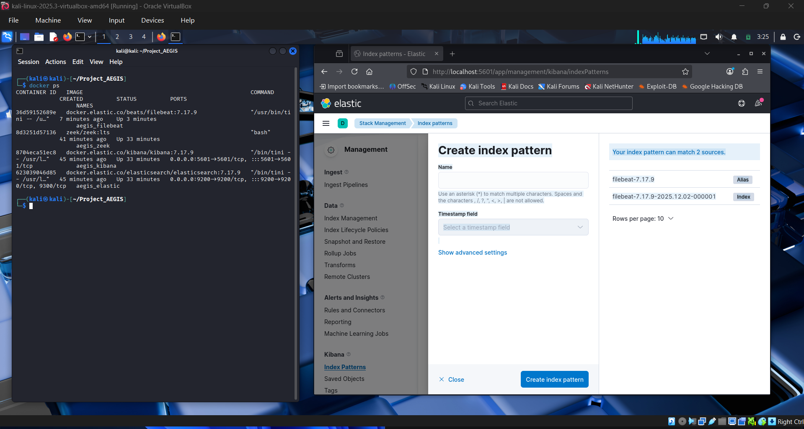
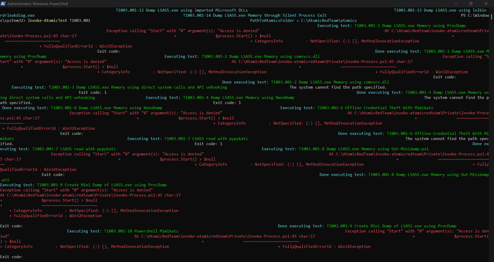
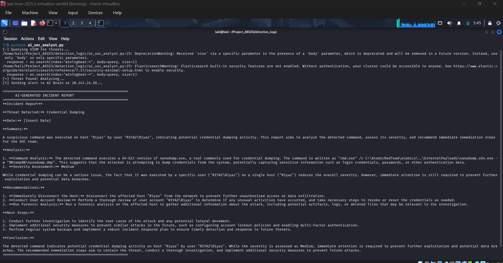

# Project AEGIS: AI-Powered Autonomous Purple Team Lab
  

## 📋 Executive Summary
Project AEGIS is a closed-loop **Purple Team** architecture designed to simulate, detect, and analyze advanced persistent threats (APTs) without relying on commercial cloud vendors. 

By integrating **Infrastructure as Code (Docker)**, **Endpoint Telemetry (Sysmon)**, and **Local Generative AI (Llama3)**, this project demonstrates an end-to-end security engineering pipeline:
1.  **Simulate:** Executed MITRE ATT&CK technique **T1003.001 (LSASS Dumping)** using Atomic Red Team.
2.  **Detect:** Engineered a custom Python-based detection engine querying an Elastic Stack (ELK) SIEM.
3.  **Analyze:** Automated Level-1 triage using a local LLM (Ollama) to generate incident reports and remediation steps in real-time.

## 🏗️ Architecture
The lab operates on a hybrid-network model, bridging a Windows Endpoint (Victim) and a Kali Linux SOC (Attacker/Defender) via custom logging pipelines.

## 🛠️ Technical Stack
* **SIEM & Data Lake:** Elastic Stack 7.17 (Dockerized on Kali Linux).
* **Network Telemetry:** Zeek (Bro) running in Promiscuous Mode (Bridged Adapter).
* **Endpoint Telemetry:** Sysmon (SwiftOnSecurity Config) + Winlogbeat.
* **Adversary Emulation:** Atomic Red Team (PowerShell).
* **Automation & AI:** Python 3 + Elasticsearch-Py + Ollama (Llama3 model).

## 🚀 Key Engineering Modules
1. **Infrastructure as Code (Docker)**
Deployed a resource-constrained ELK stack (limited to 2GB RAM) using Docker Compose to ensure portability and stability on consumer hardware.

2. **The Data Pipeline (ETL)**
Engineered a custom pipeline to normalize JSON logs from Zeek (Network) and Sysmon (Endpoint) into a unified Elasticsearch index.

3. **Adversary Emulation (Red Team)**
Simulated MITRE T1003.001 (Credential Dumping) using nanodump.x64.exe.

* **Observation:** Windows Defender blocked the execution, but Sysmon successfully captured the access attempt.

4. **Custom Detection Logic (Blue Team)**
Instead of relying on pre-built rules, I wrote a Python script to query the SIEM for process.command_line containing specific threat signatures (e.g., "nanodump"), bypassing timezone latency issues with wildcard querying.

5. AI-Driven Incident Response (Force Multiplier)
Integrated a local LLM (Ollama) to parse raw JSON logs. The system automatically:
* **Identifies the User and Host.**
* **Explains the malicious command (NanoDump).**
* **Generates a professional Incident Report with remediation steps.**

## 🗺️ Implementation Roadmap
This project was executed in four distinct engineering phases, simulating a real-world SecOps deployment lifecycle:

### Phase 1: Infrastructure Engineering (The Foundation)
* **Objective:** Architect a resource-efficient SIEM capable of running on consumer hardware (16GB RAM) without cloud costs.
* **Action:** Deployed Elastic Stack 7.17 via Docker Compose on a Kali Linux VM.
* **Optimization:** Configured strict Java Heap limits (-Xms1g) and container resource caps to allow parallel execution of the Network Sensor (Zeek) and the SIEM.

### Phase 2: Telemetry Pipeline (ETL)
* **Objective:** Unify disparate log sources into a single data lake for correlation.
* **Network Layer:** Configured Zeek in "Promiscuous Mode" (Bridged Adapter) to tap the physical interface and inspect real-time traffic.
* **Endpoint Layer:** Deployed Sysmon (SwiftOnSecurity Config) on the Windows Host to capture high-fidelity process events, shipped via Winlogbeat to the Kali VM.

### Phase 3: Adversary Emulation (Red Team)
* **Objective:** Generate realistic "noise" to validate detection logic.
* **Tooling:** Utilized the Atomic Red Team framework to execute controlled MITRE ATT&CK techniques.
* **Scenario:** Executed T1003.001 (OS Credential Dumping) using nanodump.x64.exe to trigger endpoint defenses and generate "Access Denied" telemetry artifacts.

### Phase 4: Automated Defense (Blue Team & AI)
* **Objective:** Remove the "Human Bottleneck" in Tier 1 Triage.
* **Logic:** Developed a Python automated hunter (detect_nanodump.py) to query Elasticsearch for threat signatures using wildcard matching (bypassing timezone latency).
* **AI Integration:** Engineered a connector (ai_soc_analyst.py) to pipe detected log contexts to a local LLM (Llama3 via Ollama) running on the Windows Host GPU.
* **Outcome:** The system automatically produces a structured Incident Report with severity assessment and remediation steps seconds after detection.
